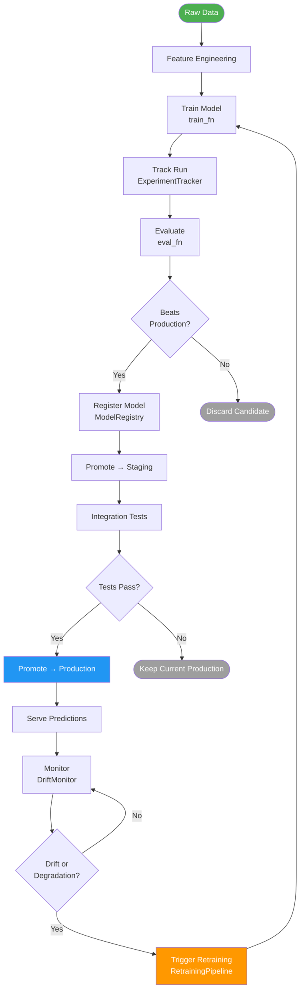
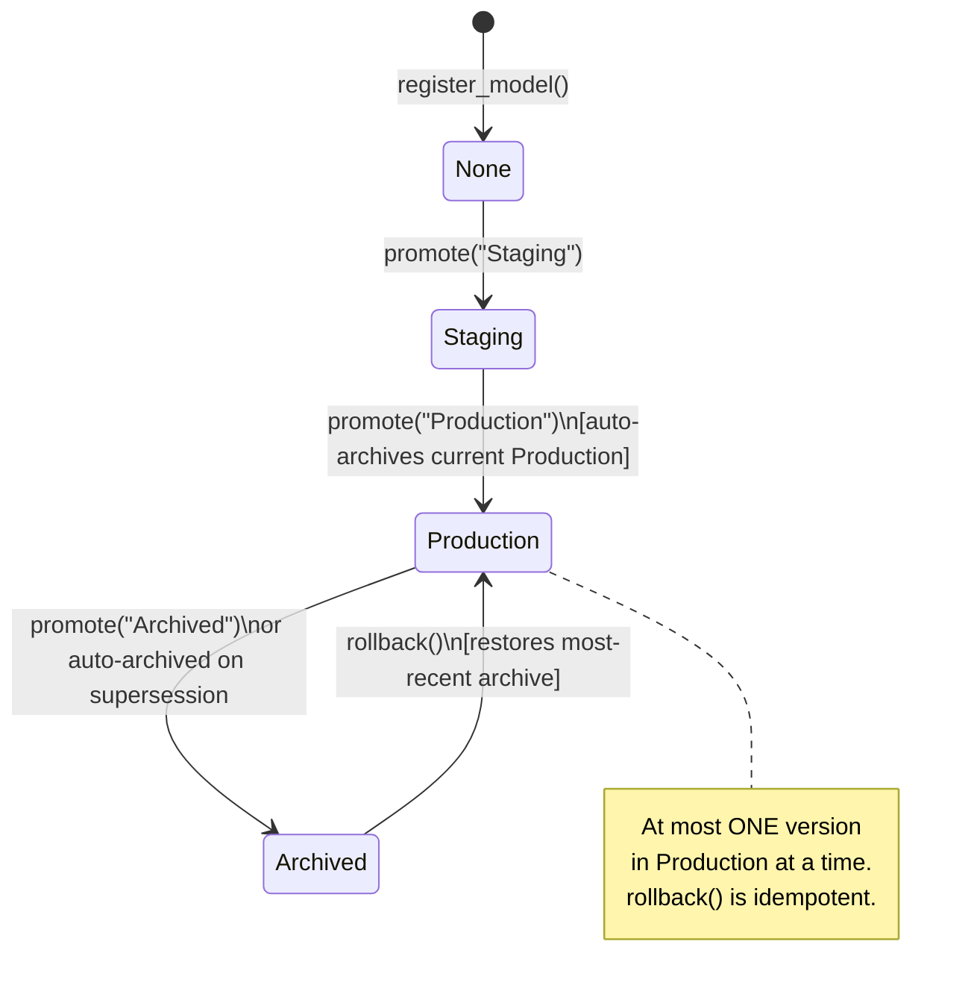
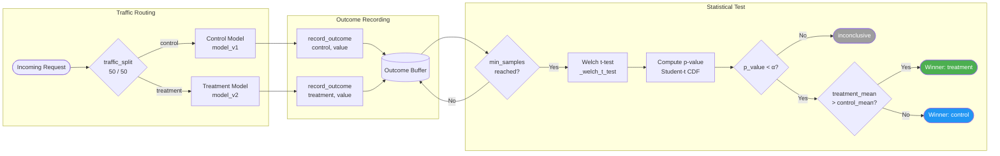
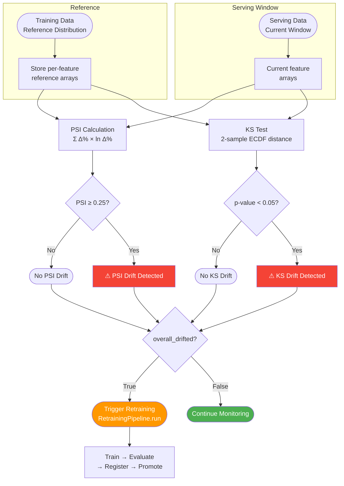

# MLOps Platform — Architecture

> All four diagrams render on GitHub natively via Mermaid.

---

## 1. Full MLOps Lifecycle

End-to-end flow from data ingestion through continuous monitoring and automated retraining.

---

## 2. Model Promotion Pipeline

Stage transitions within `ModelRegistry`, including the rollback escape hatch.

---

## 3. A/B Testing Decision Flow

How `ABTest` collects outcomes, runs Welch's t-test, and declares a winner.

---

## 4. Drift Detection Pipeline

How `DriftMonitor` detects distribution shift and triggers automated retraining.

